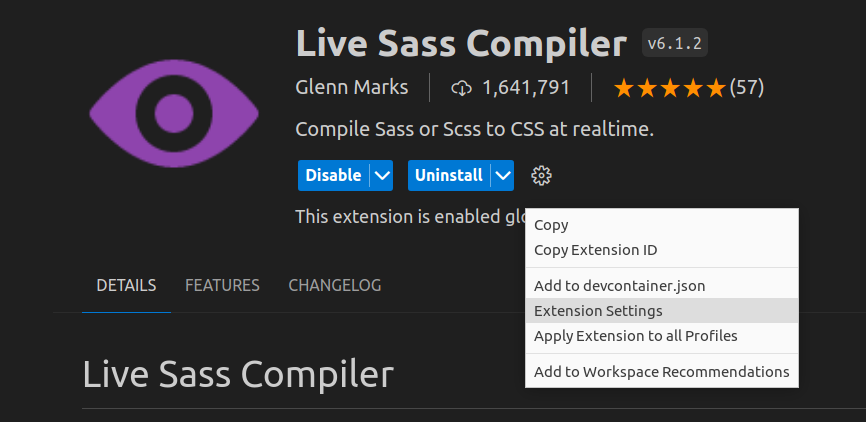
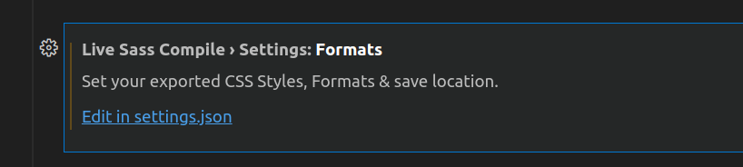
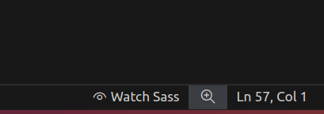
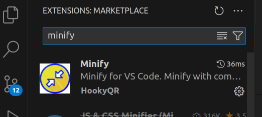
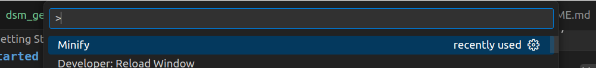
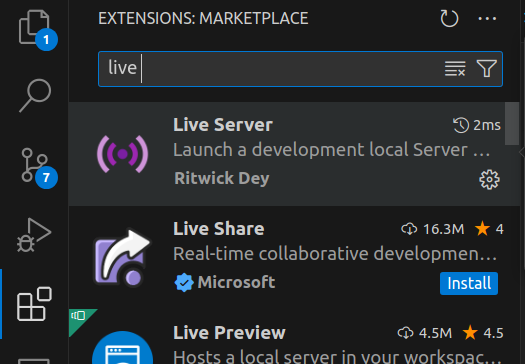
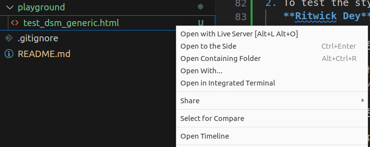

## DSM web resources

This repository contains the styles and scripts for the DSM web development.


## Getting Started
1. Clone the repository
```bash
git clone git@github.com:ucsd-dsm/dsm-web-resources.git
```

### CSS
1. It is recommended to use VSCode as the IDE for development.
2. In VSCode, install the `Live Sass Compiler` by **Glenn Marks** extension.
   There is another one by **Ritwick Dey**. Do not use that one.
3. After installing the extension, go the extension settings
    
   

   Go to Formats and click on `Edit in settings.json`. 

   

    Change the following configuration to the `settings.json` file.
    From:
    ```json
        "liveSassCompile.settings.formats": [
        {
            "format": "expanded",
            "extensionName": ".css",
            "savePath": null,
            "savePathReplacementPairs": null
        }
    ],
    ```
    To:
    ```json
    "liveSassCompile.settings.formats": [

        {
            "format": "expanded",
            "extensionName": ".css",
            "savePath": null,
            "savePathReplacementPairs": null
        },
        {
            "format": "compressed",
            "extensionName": ".min.css",
            "savePath": null,
            "savePathReplacementPairs": {
                "scss": "css"
            }
        }
    ],
    ```
4. Click on `Watch Sass` button on the bottom right corner of the window.

    
5. Open a `.scss` file and start writing the styles. The `.css` file will be generated automatically.

### JS
1. There is no `ts` support for now. Just write the js code in the `js` folder.
2. Install the `minify` extension by **HookyQR**.
   
    

   The settings are already configured in `.vscode/settings.json` file. You do not need to change anything.

   For the first time of each js file, you need to press `F1` and 
   type `Minify`, then select `Minify` option.
    
   
     
   Then you will see the minified version of the file in the same folder. 
   Later on, the minified file will be generated automatically when you 
   save the file.


## Testing
1. There is a `playground` folder in the root directory. You can test the styles and scripts there. For example, there is a 
`test_dsm_generic.html` file. You can test the styles and scripts there.
2. To test the styles, you can use the `Live Server` by 
   **Ritwick Dey**.

   

    Navigate to the `html` file and right-click on the file.
    Select `Open with Live Server`.

   

   This step is optional. You can open the `html` file in the browser as well, but live server has hot reload feature.
   It will reload the page automatically when you save the file.
   Otherwise, you have to refresh the page manually in the browser.
3. Turn on Sass watch, Live Server, and have fun editing the styles and scripts.
4. The `main` branch is for production. Use the `dev` branch for development.
5. This repository is public. Do not include any sensitive information in the files.


### CSS
1. To test the styles, include the `css` file in the `html` file
   head section.
    ```html
    <link rel="stylesheet" href="../css/<FOLDER_NAME>/<FILE_NAME>.css">
    ```
   Do not include the `scss` file in the `html` file. The `scss` file is for
   for your convenience to write the styles. Here you want to use the compiled
    `css` file.

### JS
1. To test the scripts, include the `js` file in the `html` file. Depending on the
   script, you can include the file in the head or body section.
    ```html
    <script src="../js/<FOLDER_NAME>/<FILE_NAME>.js"></script>
    ```

## Reference resources in production
1. For `css` and `js`, we use `jsdelivr` as the proxy CDN. You can use the following
   format.
   ```html
   https://cdn.jsdelivr.net/gh/ucsd-dsm/dsm-web-resources@<BRANCH>/<PATH IN REPO>
   ```
    For example, to include the `dsm-generic.css` file in the `html` file, you can use the following

   ```html
   https://cdn.jsdelivr.net/gh/ucsd-dsm/dsm-web-resources@main/css/dsm_generic_styles/styles.min.css
   ```
   > Note: For production, use the minified version of the file, `min.css` for `css` and `min.js` for `js`.
2. Reference the `css`
   -  Use directly in the `html` file.
      
        ```html
        <link rel="stylesheet" href="https://cdn.jsdelivr.net/gh/ucsd-dsm/dsm-web-resources@main/css/dsm_generic_styles/styles.min.css">
        ```

   -  Use it on the top of your project styles. 
        One can use the [`@import`](https://developer.mozilla.org/en-US/docs/Web/CSS/@import) rule to include the styles.
        ```css
        @import url('https://cdn.jsdelivr.net/gh/ucsd-dsm/dsm-web-resources@main/css/dsm_generic_styles/styles.min.css');

        /* Your styles */
        h1 {
            color: red;
        }
        ```
        The import rules are similar to scss import rules. 
3. Reference the `js`
   - Import the script to global scope.
        ```html
        <script src="https://cdn.jsdelivr.net/gh/ucsd-dsm/dsm-web-resources@main/js/dsm_generic/dsm_generic_funcs.min.js"></script>
        ```
   - Import the script as Javascript module.
        ```html
        <script type="module">
        import { testFunc } from 'https://cdn.jsdelivr.net/gh/ucsd-dsm/dsm-web-resources@main/js/dsm_generic/dsm_generic_funcs_module.min.js';
        
        myFunc();
        </script>
        ```
4. Images are stored in the `img` folder. You can reference the images using the following format.
    ```html
    
    ```